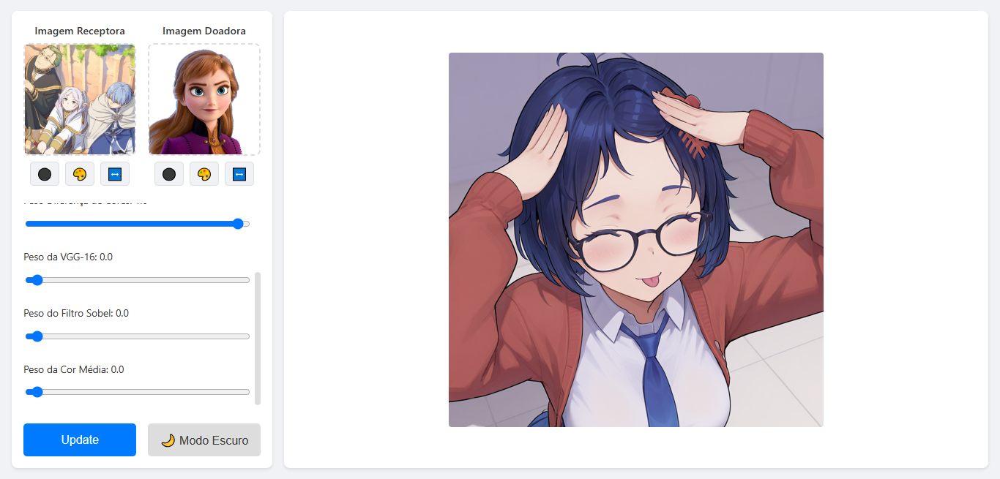
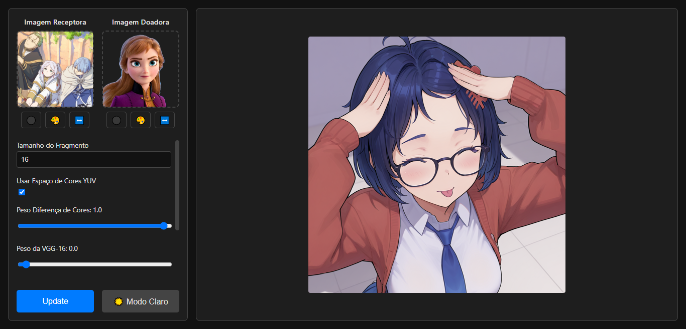

Trabalho realizado durante o curso da disciplina de Visão Computacional, lecionada pelo professor Leandro Fernandes no primeiro semestre de 2025 - Universidade Federal Fluminense (UFF)

# Previews:



# Instruções de Uso:


````shell
python -m venv .venv
````

````shell
.venv\Scripts\activate
````

````shell
pip install -r requirements.txt
````

```shell
uvicorn src.web_main:app --reload
```